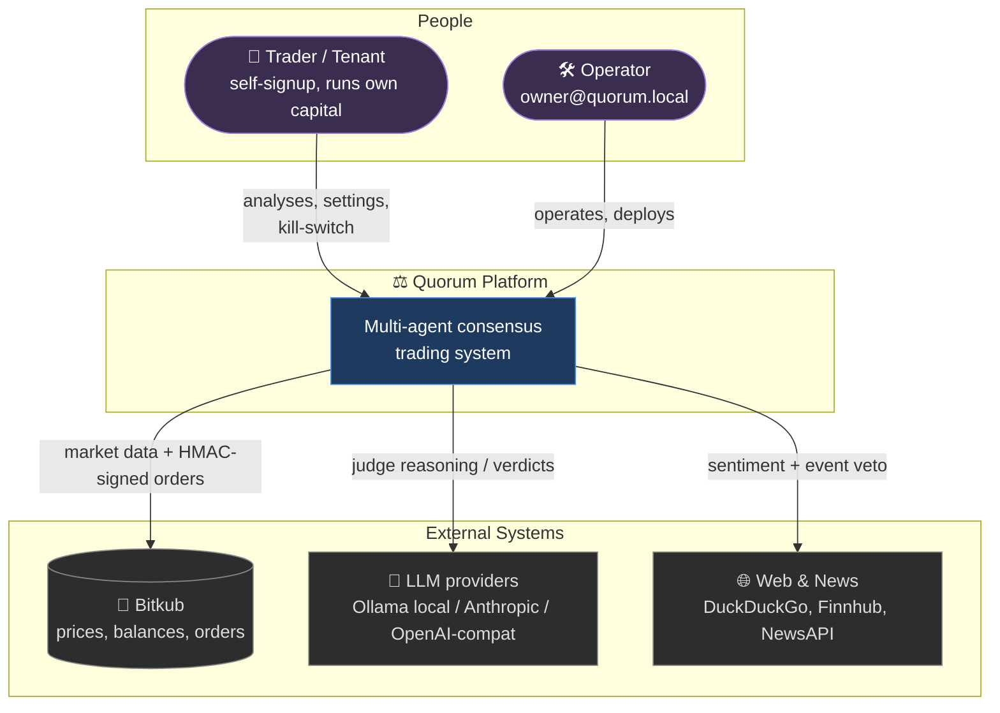

# System Context (C4 — Level 1)

How Quorum sits in the world: who uses it, and which external systems it depends on.

## Actors

| Actor | Goal | Touchpoints |
|-------|------|-------------|
| **Trader / Tenant** | Grow capital with disciplined automation | Web UI: trigger analysis, set risk/strategy, watch positions, pull the kill-switch |
| **Operator** | Keep the platform healthy | Deploy, monitor governor/alerts, manage the default admin account |

## External dependencies

| System | Role | Failure posture |
|--------|------|-----------------|
| **Bitkub** | Source of truth for prices, balances, and order execution (THB pairs) | Price read fails → skip tick; order fails → record + alert, never silently lose state. See [[Broker-Integration]]. |
| **LLM providers** | The judge's reasoning engine. Local **Ollama** first, cloud (Anthropic / OpenAI-compatible) as fallback | If all providers fail → deterministic **rule-based planner** takes over (never blocks trading). See [[Analysis-Pipeline]]. |
| **Web / News** | Sentiment signal + a hard **veto** on critical events (hacks, delistings) | Unavailable → agents abstain rather than cast bad votes. |

## Trust & data-sensitivity boundaries

- **Bitkub API credentials are per-tenant** and stored encrypted server-side; they never leave the backend and are never shared between tenants. ([[Deployment-and-Security]])
- The **web UI never holds broker secrets** — it authenticates with a JWT and an `X-Account-Id`; the backend resolves the right credentials.
- The **LLM never sees credentials** — only market structure, votes, and portfolio context.

Next: [[Container-Architecture]]
