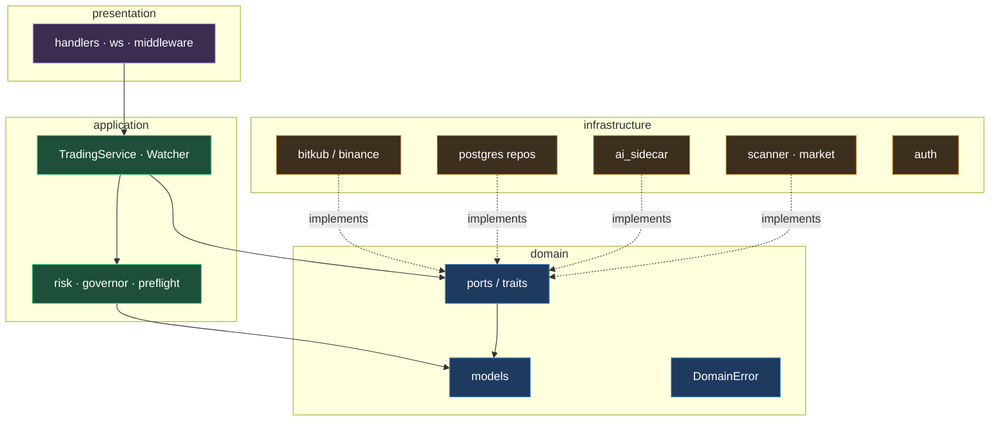

# Clean Architecture (the Rust core)

The Trading Core follows a strict **ports-and-adapters / clean architecture** layering. The point: business rules (risk, planning, P&L) never depend on a database driver or an HTTP client, so they stay pure and testable, and infrastructure can be swapped without touching the rules.

## The dependency rule

**Source code dependencies point only inward.** `domain` knows nothing about anyone. `application` depends on `domain`. `infrastructure` and `presentation` depend on `application` + `domain`. Crucially, infrastructure adapters **implement domain ports** (traits) — so the application calls an interface, and the concrete Bitkub/Postgres/LLM type is injected at startup.

## Layers

| Layer | Path | Contains | Depends on |
|-------|------|----------|------------|
| **domain** | `backend/src/domain/` | `models` (entities, enums, value objects), `ports` (traits: `Broker`, `TradeRepository`, `PlanRepository`, `AiEngine`, `MarketData`…), `DomainError` | nothing |
| **application** | `backend/src/application/` | `TradingService` (the orchestrator), `Watcher` (the loop), and the **pure rule modules**: `risk`, `governor`, `preflight` | domain |
| **infrastructure** | `backend/src/infrastructure/` | adapters: `bitkub`, `binance`, `postgres*`, `ai_sidecar`, `scanner`, `market`, `auth`, `qpack`, `broker_resolver` | application + domain |
| **presentation** | `backend/src/presentation/` | axum `handlers`, `ws`, `middleware`, shared `state` | application + domain |

## Why this pays off here

- **The money path is unit-testable without a broker or a DB.** `risk::evaluate`, `governor::evaluate`, `preflight::check_buy`, the trailing-stop maths, and realized-P&L walking are all **pure functions** with dozens of tests — no network, no Postgres. (66 cargo tests run in <1s.)
- **Swapping a broker is an adapter, not a rewrite.** `Broker` is a trait; `BitkubBroker` and a `Binance` skeleton both implement it. Per-tenant resolution happens behind `BrokerResolver`.
- **The LLM is just a port.** `AiEngine` hides whether reasoning came from Ollama, a cloud model, or the rule-based planner.

## Key seams (ports)

| Port (trait) | Adapter(s) | Hides |
|--------------|-----------|-------|
| `Broker` | `BitkubBroker`, `Binance`(skeleton), paper | order placement, balances, prices |
| `MarketData` / `MarketScanner` | `BitkubMarket`, `MomentumScanner` | the tradable universe & tickers |
| `TradeRepository` / `PlanRepository` / `SettingsStore` / `AlertStore` | `postgres*` | persistence + tenant scoping |
| `AiEngine` | `ai_sidecar` | the council/judge HTTP contract |
| `SecretStore` / `BrokerResolver` | `postgres` + factory | per-tenant credential resolution |

Related: [[Container-Architecture]] · [[Domain-Model]] · [[Order-Execution]]
