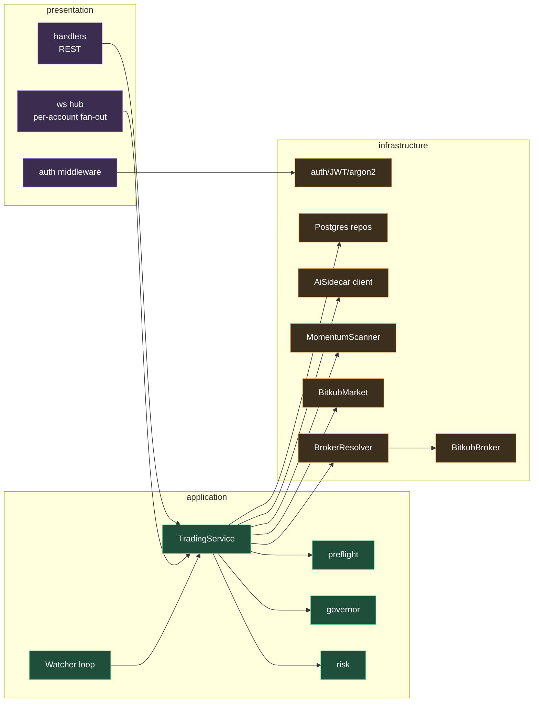
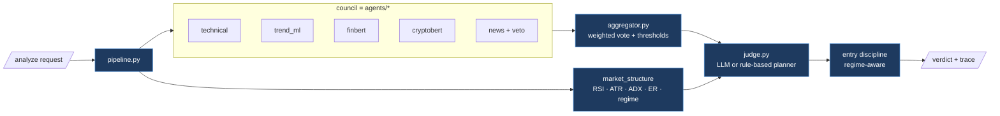

# Component Map (C4 — Level 3)

Inside the two core containers.

## Trading Core (Rust)

| Component | Role |
|-----------|------|
| **TradingService** | The orchestrator. `run_once` (deep analysis → plan), `check_triggers` (price hits entry → act), `check_exits` (manage/close), `execute` (the order path). |
| **Watcher** | The multi-tenant loop: every tick, watch prices for all auto-trading accounts; infrequently, run deep analysis. See [[Order-Execution]]. |
| **risk / governor / preflight** | Pure decision modules — the safety rails. |
| **BrokerResolver** | Maps `account_id` → the right per-tenant `Broker` with that tenant's credentials. |
| **MomentumScanner / BitkubMarket** | Build & filter the tradable universe (excludes broker coins — [[Broker-Integration]]). |
| **AiSidecar client** | The `AiEngine` adapter that calls the Python layer. |

## AI Layer (Python)

| Component | Role |
|-----------|------|
| **pipeline.py** | Orchestrates one analysis: fetch candles → compute structure → run council → aggregate → judge → emit trace. |
| **agents/** | The five analysts; each returns `{action, confidence, reasoning}` or abstains. |
| **aggregator.py** | Weighted vote, asymmetric BUY/SELL thresholds, structural requirement, regime tagging. |
| **judge.py** | LLM judge (Ollama→cloud chain) **or** the deterministic `_plan_from_consensus`; then `_apply_entry_discipline`. See [[Entry-Strategy]]. |

Related: [[Analysis-Pipeline]] · [[Clean-Architecture]]
