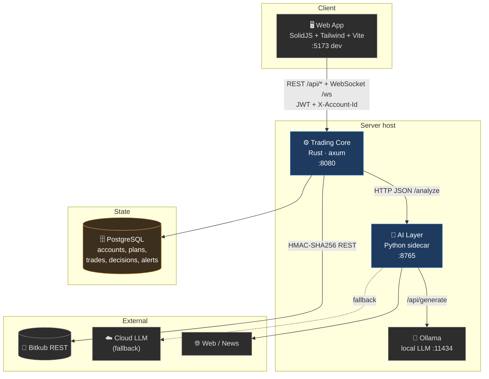

# Container Architecture (C4 — Level 2)

The deployable units and the protocols between them.

## Containers

| Container | Tech | Responsibility | Port |
|-----------|------|----------------|------|
| **Web App** | SolidJS, Tailwind, Vite | Dashboard, tracking, settings, kill-switch, reasoning traces. Vite proxies `/api` + `/ws` to the core. | 5173 (dev) |
| **Trading Core** | Rust, axum, sqlx, tokio | The brain-stem: auth, multi-tenancy, the watch loop, plan lifecycle, preflight + risk, broker I/O, the deterministic rule-based planner, persistence. | 8080 |
| **AI Layer** | Python (stdlib http) | The council + aggregator + judge. Owns indicators, regime detection, sentiment, news veto, and LLM orchestration. | 8765 |
| **Ollama** | local LLM runtime | Hosts the judge model (e.g. `qwen3:14b`). First in the provider chain. | 11434 |
| **PostgreSQL** | 14+ | All durable state, scoped by `account_id`. Migrations run on core boot. | 5432 |

## Why two services (Rust core + Python sidecar)?

A deliberate **separation of competence**:

- **Rust** owns everything that must be *fast, safe, and deterministic*: money movement, risk caps, concurrency across many tenants, the websocket fan-out. Memory-safe, no GC pauses, compile-time guarantees on the money path.
- **Python** owns everything that lives in the *ML/LLM ecosystem*: pandas-style indicators, HuggingFace sentiment models, LLM client libraries. Iterating on strategy shouldn't require recompiling the trading engine.

The seam is a single narrow HTTP contract (`/analyze`), which means either side can be scaled, restarted, or replaced independently. See [[Component-Map]].

## Communication contracts

| Edge | Protocol | Auth | Notes |
|------|----------|------|-------|
| Web → Core | REST + WebSocket | JWT bearer + `X-Account-Id` (or `?token=&account_id=` on WS) | Per-account event filtering on the WS. |
| Core → AI | HTTP JSON | none (loopback) | `/analyze` returns verdict + full trace; streaming variant for live reasoning. |
| Core → Bitkub | HTTPS REST | HMAC-SHA256 (per-tenant keys) | `ts + METHOD + path + body` signature. |
| AI → LLM | HTTP | provider key (cloud) | Ollama → cloud fallback → rule-based. |

## Cross-cutting concerns

- **Multi-tenancy** — every request carries an account; middleware injects `Ctx{user_id, account_id, account_kind}`. ([[Data-Model-ERD]])
- **Resilience** — every external dependency has a degraded mode (skip tick / abstain / rule-based planner / record+alert).
- **Wire efficiency** — an optional binary protocol (QPACK) compresses high-frequency WS frames.

Next: [[Clean-Architecture]] · [[Component-Map]]
