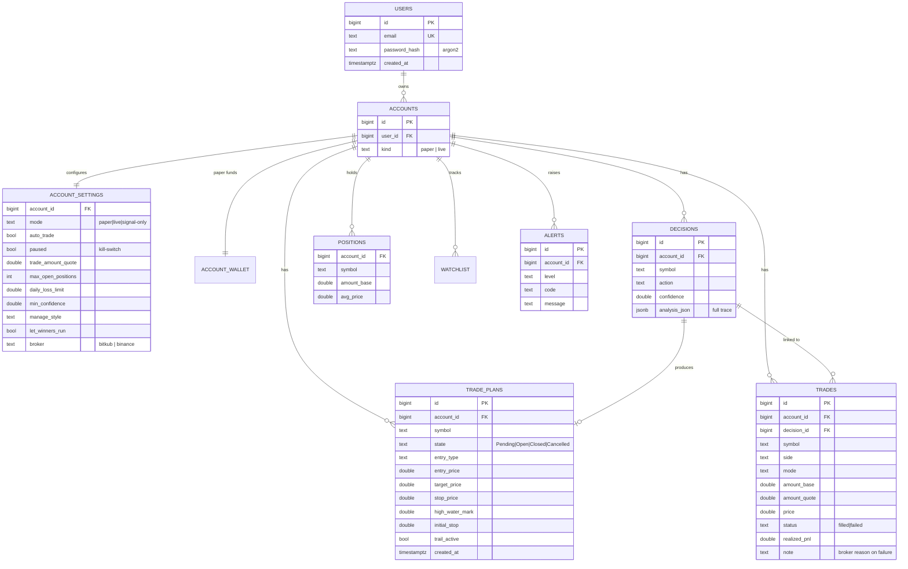

# Data Model (PostgreSQL ERD)

Every business table is **scoped by `account_id`**. Multi-tenancy is not a feature bolted on — it's the spine of the schema (migration `0006_identity` replaced the original singletons with per-account tables).

## Tenancy & access pattern

- A request arrives with a **JWT** (identifies the user) and an **`X-Account-Id`** header. Middleware validates the account belongs to the user and injects `Ctx{user_id, account_id, account_kind}`.
- Every repository method takes `account_id` and filters on it — there is no "global" query path.
- **WebSocket** events carry an `account_id` and are filtered per subscriber, so one tenant never receives another's trade/alert stream.

## Notable design choices

| Choice | Rationale |
|--------|-----------|
| `trades.note` stores the broker's failure reason | So a `failed` order is explainable (e.g. *"Bitkub error 61: broker coin"*) — surfaced in the UI and Alerts. See [[Broker-Integration]]. |
| `decisions.analysis_json` is `jsonb` | The full reasoning trace is replayable from the UI ("view reasoning"). |
| Plans carry `initial_stop` + `high_water_mark` + `trail_active` | Enables R-multiple trailing without recomputing history. See [[Position-Management]]. |
| Realized P&L is recomputed from the trade ledger | Broker-independent correctness; survives a broker reporting `avg=0`. |
| Migrations are append-only and checksum-locked (sqlx) | An applied migration is never edited — new behaviour = new migration. |

Related: [[Domain-Model]] · [[Deployment-and-Security]]
