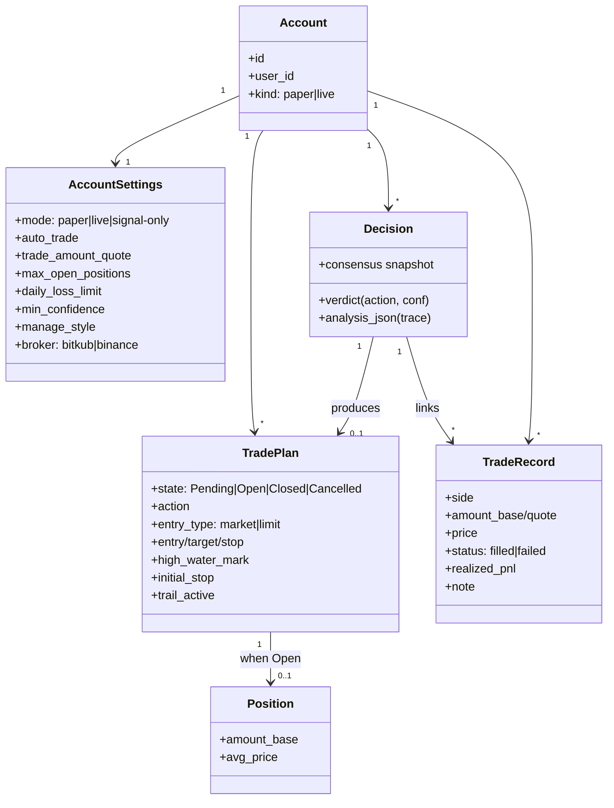
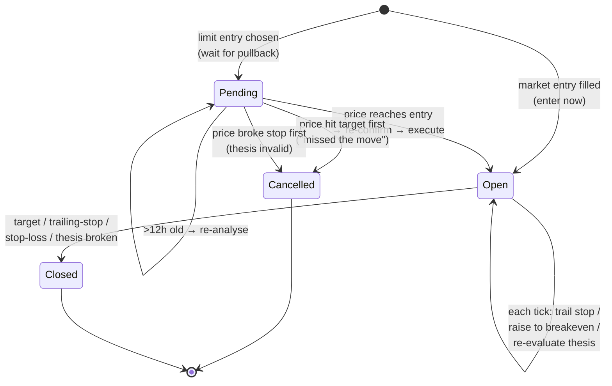

# Domain Model

The core nouns and the one state machine that matters most.

## Core entities

## Account kind vs. trading mode (a deliberate distinction)

These are **two different axes** and conflating them caused a real bug (a signal-only live account once showed a fake paper balance):

- **Account kind** (`paper` | `live`) — *what the money is.* Determines which wallet/balance is real. Persistent.
- **Trading mode** (`paper` | `live` | `signal-only`) — *what the bot is allowed to do right now.* A live account can run `signal-only` (analyse, never order). A setting, changeable anytime.

Balance display follows **kind**; the order/no-order decision follows **mode**. See [[Glossary]].

## The Trade-Plan lifecycle

The single most important state machine in the system.

| Transition | Trigger | Owner |
|------------|---------|-------|
| → Pending | Judge chose a `limit` entry (regime says wait) | `track_pending` |
| → Open (immediate) | Judge chose `market` + confidence ≥ floor | `enter_now` → `execute` |
| Pending → Open | Live price reaches entry, re-confirmed by fresh analysis | `check_triggers` → `confirm_and_enter` |
| Pending → Cancelled | Target or stop hit *before* entry, or buy rejected | `check_triggers` |
| Open → Open | Trailing/breakeven update; thesis re-eval | `check_exits` + deep re-analysis |
| Open → Closed | Exit condition met | `check_exits` → `execute(SELL)` |

> The new [[Entry-Strategy]] shifts the **→ Open (immediate)** path to fire much more often in trending regimes — the previous design almost always took **→ Pending** and then **→ Cancelled (missed the move)**.

## Value objects & invariants

- **R (risk unit)** = `entry − initial_stop`. Trailing is expressed in R. ([[Position-Management]])
- **Realized P&L** is computed deterministically from the local trade ledger (`(fill − avg_cost) × qty`), never trusted from the broker.
- **Stops only ratchet up** — `refresh_review` and trailing use `GREATEST`; risk is never widened.
- **A hard catastrophic cap** (`MAX_LOSS_PCT ≈ 6%`) floors every exit stop regardless of the plan.

Related: [[Data-Model-ERD]] · [[Position-Management]]
