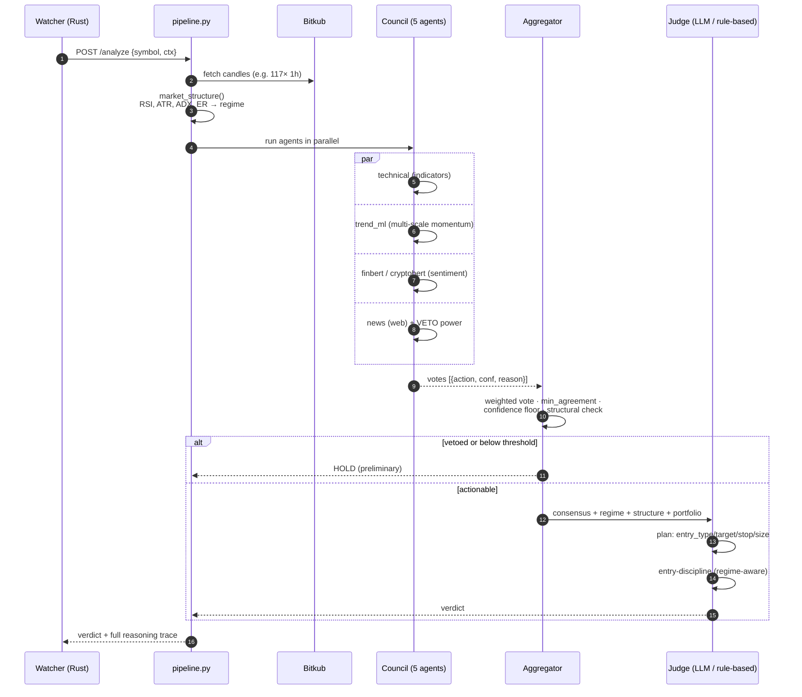

# Flow: Analysis Pipeline

How a symbol becomes a verdict. This is the "thinking" half of the system (infrequent, high-quality) — distinct from the "watching" half ([[Order-Execution]]).

## Stage detail

| Stage | Module | What it produces |
|-------|--------|------------------|
| **Market structure** | `pipeline._market_structure` | RSI(14), ATR, support/resistance(20), momentum(5/20/50), and the **regime** (trending / weak-trend / ranging via ADX + Efficiency Ratio). |
| **Council** | `agents/*` | Five independent opinions. A model that can't run (e.g. transformers missing) **abstains** (`ok=false`) rather than casting a bad HOLD vote that would block consensus. |
| **Aggregator** | `aggregator.py` | Weighted vote with **asymmetric thresholds** (BUY needs a touch more confidence than SELL), a **structural requirement** (technical/trend_ml must concur or confidence is dampened), and the **news veto**. Resolves to HOLD unless agreement ≥ N and confidence ≥ floor. |
| **Judge** | `judge.py` | Turns an actionable consensus into a concrete plan, applying regime-aware RR thresholds and portfolio risk rules. |

## Degradation ladder (never blocks)

The **rule-based planner** is a real planner, not a stub: stop from support or 1.5×ATR, target capped at resistance, regime-aware RR gate, confidence- and regime-based sizing — and it runs the same [[Entry-Strategy]] discipline as the LLM path. So a total LLM outage degrades *quality*, never *availability*.

## Why consensus beats a single model

- A single indicator/model has a regime where it's systematically wrong. Requiring **agreement across diverse methods** (quant + ML + sentiment + news) filters out single-method failure modes.
- The **veto** asymmetry encodes a real-world truth: one credible "this is a hack" signal should override five bullish technicals.

Related: [[Entry-Strategy]] · [[Component-Map]]
