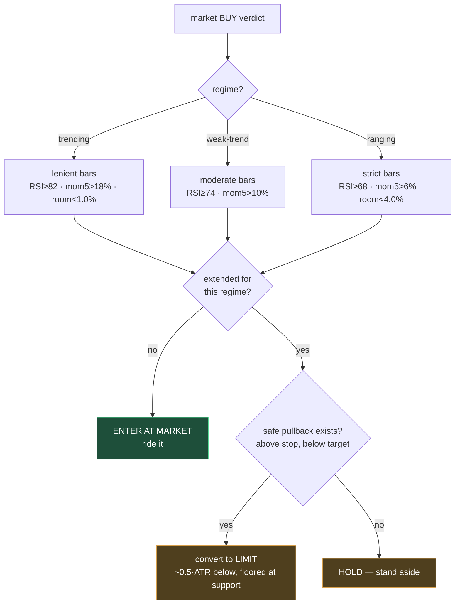

# Flow: Entry Strategy (regime-aware)

> This is where Quorum's edge lives. It was also the site of a real, instructive design flaw — documented here because the fix is the design.

## The flaw: a strategy at war with itself

The discovery scanner selects **momentum** coins — things that are *moving strongly right now*. But the original entry logic always converted a BUY into a **pullback limit** ("wait for a 1.5–4.5% dip"). So the system screened for **strength** and then demanded **weakness** to enter.

Result on a trending universe: price kept running, never dipped to the limit, hit the target first, and the plan was cancelled as *"missed the move."* Two days of analysis, ~1000 BUY signals, almost zero fills. The bot was structurally wrong-footed — exactly the "only ever expecting a cheaper price" failure.


## The fix: entry style must match the regime

Entry style is now chosen by **market regime**, not by a blanket "always buy the dip" rule:

| Regime | Thesis | Entry style |
|--------|--------|-------------|
| **Trending** (ADX>25, ER≥0.35) | momentum *is* the signal | **Enter at MARKET — ride strength / breakouts.** Only convert to a pullback if *truly parabolic*. |
| **Weak-trend** (ER 0.20–0.35) | constructive but soft | Market on a clean setup; small pullback if stretched. |
| **Ranging** (ER<0.20, ADX<20) | mean-reversion edge | **Buy a pullback toward support; never chase a local high.** Near the top of the range → HOLD. |

## The anti-chase guard (deterministic, regime-tuned)

`_apply_entry_discipline` converts a market BUY to a pullback limit (or HOLD) only when the price is over-extended **for its regime**. The thresholds scale with the regime, so a healthy trend isn't mistaken for a blow-off:



`_EXT_THRESHOLDS` (per regime): `(min_room_to_resistance, max_dist_above_support, hot_momentum_5, overbought_rsi)`

```
trending   → (0.010, 0.30, 0.18, 82)   # let the entry run
weak-trend → (0.025, 0.15, 0.10, 74)
ranging    → (0.040, 0.08, 0.06, 68)   # only buy dips
unknown    → (0.030, 0.12, 0.08, 72)   # neutral default
```

## How it connects to execution

A `market` verdict now flows straight to `enter_now → execute` in the Rust core (the `enter_now` gate requires `entry_type == "market"`). So the regime fix doesn't just change advice — it changes whether the trade actually fires *now* vs sits as a pending limit. See [[Order-Execution]] and the plan lifecycle in [[Domain-Model]].

## Guardrails that remain (smart ≠ reckless)

Entering on strength is still bounded by: the **RR threshold by regime** (trending ≥1.5, weak ≥2.0, ranging ≥2.5), the **confidence floor**, the **portfolio rules** (session P&L < −6% → HOLD, deployed > 70% → caution), and the always-on **hard stop / catastrophic loss cap**. The change makes the bot *decisive in trends*, not *indiscriminate*.

> Verified by `ai-layer/tests/test_entry_discipline.py` — including cases proving a trend keeps its market entry on RSI 78 / +12% momentum, while a range converts the same conditions to a pullback.

Related: [[Analysis-Pipeline]] · [[Position-Management]] · [[Broker-Integration]]
