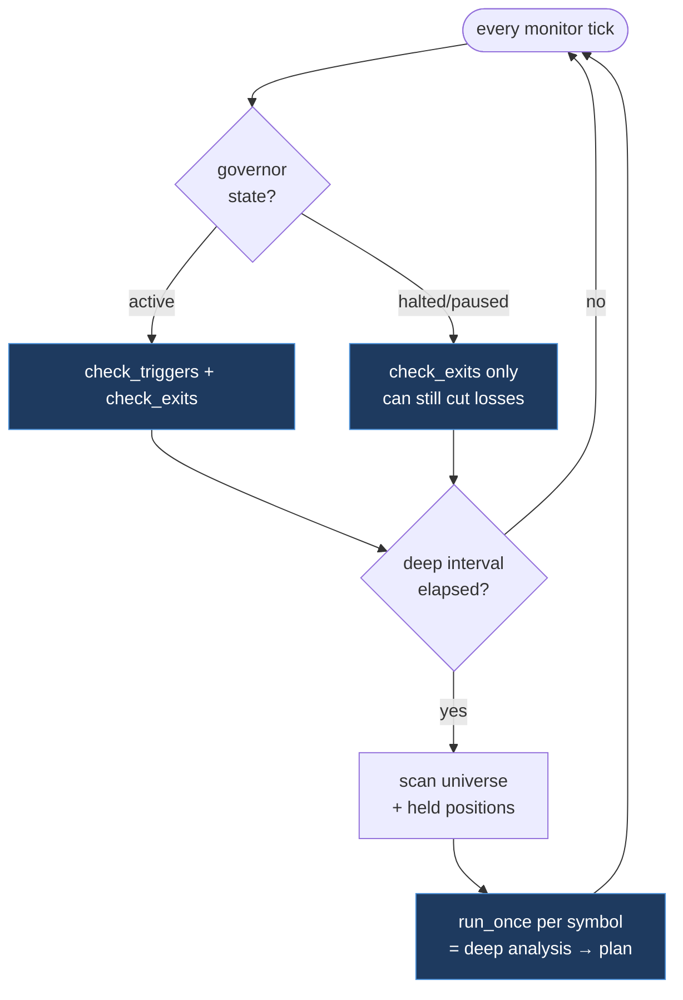
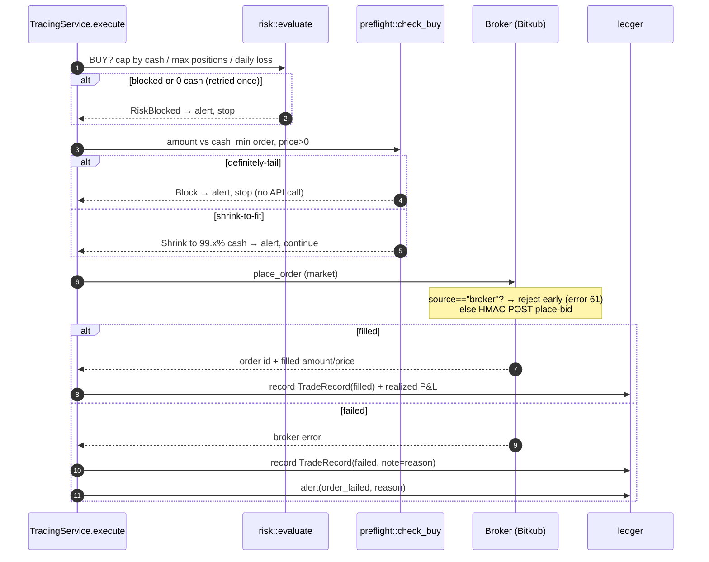

# Flow: Order Execution & the Watch Loop

The "watching" half of the system. Cheap and frequent price-watching triggers the expensive "thinking" only when it matters.

## The two-speed watch loop

- **Monitor (frequent, no AI):** `check_triggers` (did a pending plan's entry get hit?) and `check_exits` (manage/close open positions).
- **Deep (infrequent, AI):** build the universe (scanner + watchlist + **held positions, always re-evaluated**), run [[Analysis-Pipeline]] per symbol, create/adjust plans.
- **Anti-churn:** a symbol just exited gets a 30-minute re-entry cooldown.

## The order path (`execute`)

Every order — whether an immediate market entry, a triggered pending entry, or an exit — funnels through one guarded path:

## The safety rails (defence in depth)

| Layer | Module | Rejects when… | Outcome |
|-------|--------|---------------|---------|
| **Governor** | `governor` | paused / daily-loss hit / no slots / no cash | state shown in UI; no entries |
| **Risk** | `risk` | over max positions / over daily loss / 0 cash (retried) | `RiskBlocked` + alert |
| **Preflight** | `preflight` | amount ≤ 0, below min, price unreadable, cash short | `Block` (no API call) or `Shrink` to fit |
| **Broker guard** | `bitkub` | pair inactive, frozen, **broker coin (error 61)** | clear error before/after submit, recorded as `failed` |

Because the universe is now filtered to tradable **exchange** coins ([[Broker-Integration]]), the broker-coin rejection is a backstop, not the common case.

## Failure is first-class

A failed order is **never silent**: it's persisted with `status=failed` and a human-readable `note` (the exact broker reason), surfaced both in the Trades view and the Alerts stream. A pending plan whose confirmed buy fails is **cancelled** (not left to re-loop every tick).

Related: [[Entry-Strategy]] · [[Position-Management]] · [[Deployment-and-Security]]
