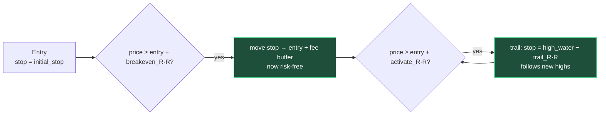
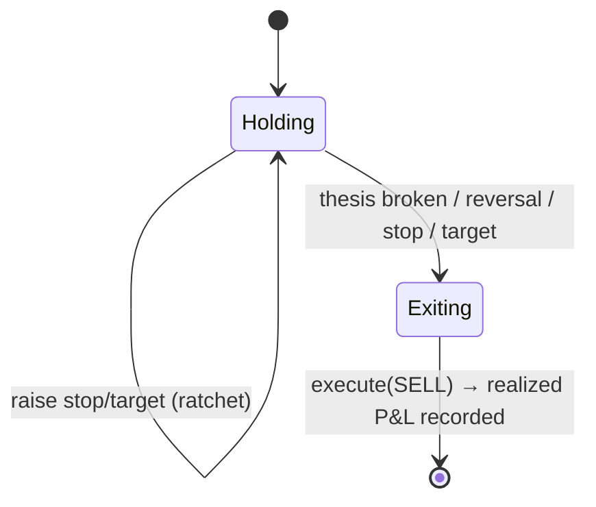

# Flow: Position Management

Once a position is **Open**, Quorum manages it like a professional rather than buy-and-forget. Two mechanisms run together: a deterministic **R-multiple trailing stop** (every tick) and **thesis re-evaluation** (every deep cycle).

## R-multiple trailing & breakeven

Risk unit **R = entry − initial_stop**. The stop ratchets — it can only ever move up, never down, and never above the current price.

`ManageCfg::from_style` presets (configurable per account):

| Style | breakeven_R / activate_R / trail_R | Character |
|-------|-----------------------------------|-----------|
| `off` | — | fixed entry-time stop only |
| `conservative` *(default)* | 0.7 / 1.0 / 1.0 | lock in fast, trail tight |
| `balanced` | 1.0 / 1.5 / 1.5 | |
| `aggressive` | 1.5 / 2.0 / 2.5 | give winners room |

Invariants (pure, unit-tested in `trading.rs`): **monotonic** (never lowers the stop), **never ≥ price**, breakeven adds a fee buffer so a "risk-free" stop truly clears costs.

## "Let winners run" vs hard take-profit

At the target, behaviour depends on `let_winners_run`:

- **on** → don't hard-sell; *tighten the trail* (trail_R × 0.5) and keep riding.
- **off** → hard take-profit at target.

Either way the trailing stop protects the gain — a winner shouldn't round-trip into a loss.

## Held-position re-evaluation (no buy-and-forget)

Held symbols are **always** re-analysed each deep cycle (previously they were filtered out — the root cause of "buys then abandons"). The judge, told it is *managing an open position*, may:

- **HOLD** — thesis intact → let the trailing stop do its job; tolerate a thesis-valid drawdown.
- **Raise** the stop/target (system ignores any attempt to *lower* the stop — risk never widens).
- **SELL** — thesis broken or clear reversal → exit decisively. Special case: setup breaking down while *still in profit* → lock it in now (a smaller certain gain beats riding to the stop).

## Exit accounting

On a live SELL, realized P&L is recorded **at sell-time** from the pre-sell average cost (`(fill − avg_cost) × qty`), then refined by a full-history recompute — so the dashboard's win/loss is correct immediately and is **broker-independent** (survives Bitkub reporting `avg=0`).

## Always-on catastrophic cap

Independent of any plan or model: the effective exit stop is floored at `avg_cost × (1 − MAX_LOSS_PCT)` (≈6%). No single trade can exceed that loss, even if the AI set a wider stop or none at all.

Related: [[Domain-Model]] · [[Entry-Strategy]] · [[Order-Execution]]
