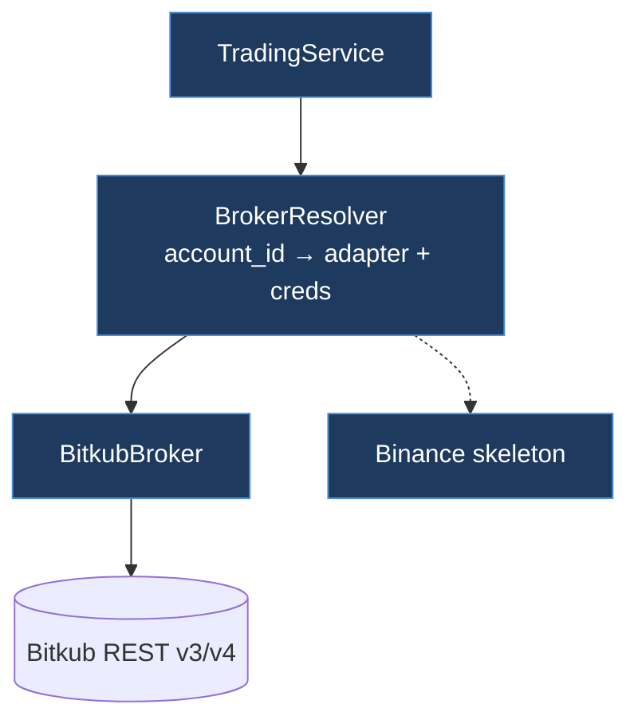
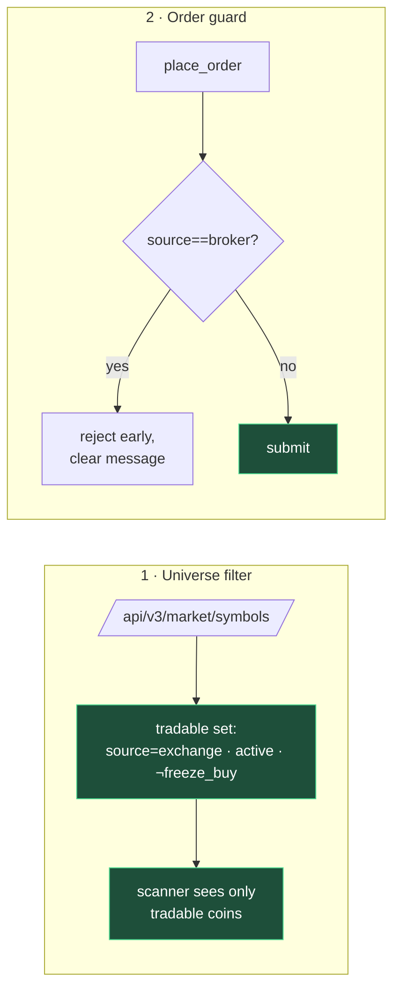

# Component: Broker Integration

The `Broker` port abstracts "the place orders happen." Today's primary adapter is **Bitkub**; a **Binance** skeleton exists behind the same trait, and credentials are resolved **per tenant**.

## Bitkub adapter essentials

- **Auth:** HMAC-SHA256 over `ts + METHOD + path + body`, headers `X-BTK-APIKEY / -TIMESTAMP / -SIGN`.
- **Orders:** market `place-bid` / `place-ask`; quantity scaling and number formatting per symbol metadata; legacy-symbol fallback.
- **Balances:** v4 wallet endpoint; **per-tenant keys**, never shared.
- **Reconciliation:** order history is walked (keyset pagination) to rebuild average cost — not trusting a single broker field.

## Exchange coins vs. broker coins (a load-bearing distinction)

Bitkub lists two kinds of THB pairs (`source` field in `/api/v3/market/symbols`):

| `source` | Where it trades | API-tradable? | min order |
|----------|-----------------|---------------|-----------|
| `exchange` | Bitkub's own order book | ✅ yes | ~10 THB |
| `broker` | routed to a third party | ❌ **no — order API returns error 61** | ~200 THB |

**This was the root cause of "two days, zero filled buys."** The momentum scanner — which favours small, fast-moving coins — kept selecting `broker` coins (≈27% of the THB universe, 121/455 pairs). The price *ticker* has no `source` field, so they passed into the universe; every buy then failed with error 61, recorded as `× Failed` with amount 0.

### The two-layer fix

1. **`BitkubMarket.tradable_set()`** fetches `/api/v3/market/symbols` (cached 5 min) and keeps only `source=exchange`, `active`, buy-unfrozen coins; `search()` filters the universe to this set. **Fails open** — if the fetch fails, it doesn't empty the universe; the order guard is the hard backstop.
2. **`place_order`** rejects a `broker`-source order up front with a human-readable reason, and **error 61 is mapped** to an explanatory message (was an opaque "see Bitkub docs").

Validated against the live API: every coin that had failed in production is `source=broker`; every coin that had ever filled is `source=exchange`. 100% predictive.

## Multi-broker direction

`BrokerKind` (`bitkub` | `binance`) + a settings dropdown + a keyed resolver factory are already in place. Enabling Binance is: add HMAC signing, map THB→USDT pairs, and test on the Binance testnet — no change to the application core, because it only speaks to the `Broker` trait. See [[Clean-Architecture]].

Related: [[Order-Execution]] · [[Deployment-and-Security]]
