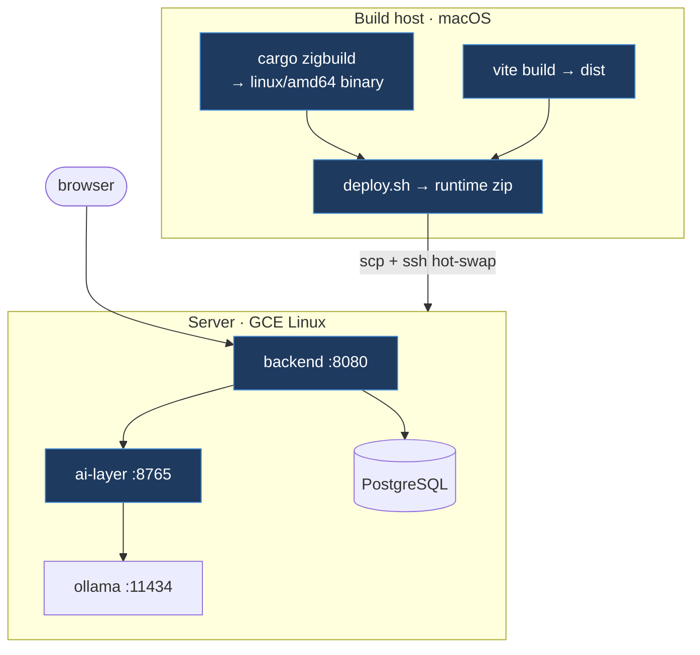
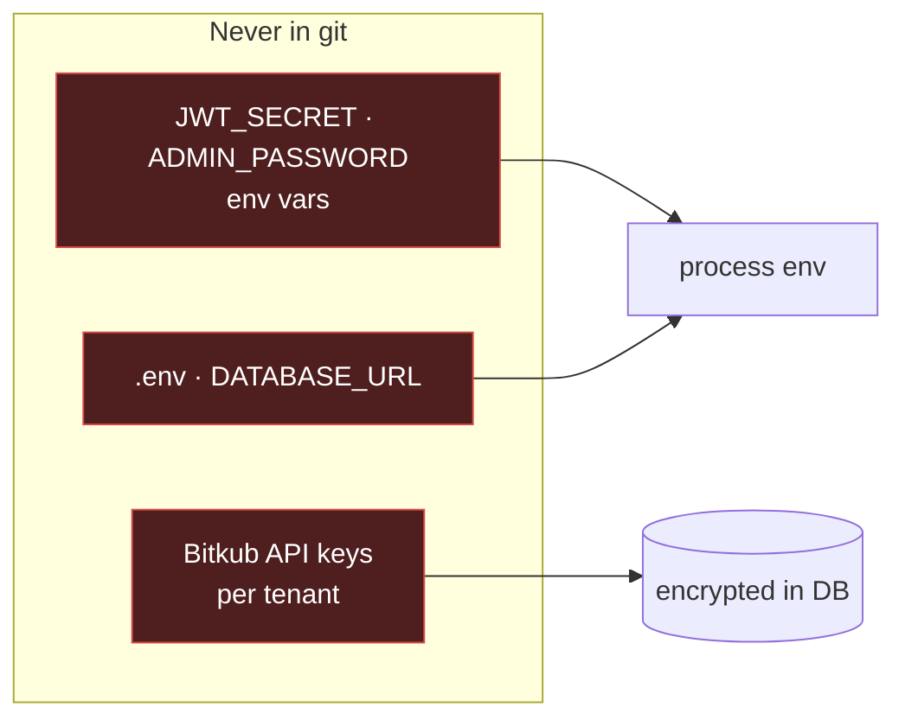

# Operations: Deployment & Security

## Deployment topology

- **Cross-build:** `cargo zigbuild --target x86_64-unknown-linux-gnu --release` (zig as the cross-linker) on macOS → a Linux binary, no Docker required.
- **Package:** `deploy.sh` builds the frontend, assembles `quorum-linux-runtime/` (binary + `ai-layer/` + `frontend/dist` + migrations), writes `BUILD_INFO.txt`, and zips it.
- **Hot-swap deploy:** `scp` the zip, then over SSH: stop services → replace binary/frontend/ai-layer/migrations → restart. **Migrations run automatically on boot.**
- **Health check:** `GET /api/health` after restart.

> A deploy restarts the live trading engine (brief downtime) and resumes auto-trading — treat it as a production change, not a dev refresh.

## Secrets model

| Secret | Where it lives | Never |
|--------|----------------|-------|
| Bitkub API key/secret | **per-tenant, encrypted in DB**, resolved by `BrokerResolver` | shared between tenants; sent to the LLM; in the repo |
| `DATABASE_URL` | `.env` (gitignored) | committed |
| `JWT_SECRET`, `ADMIN_PASSWORD` | server env vars | hardcoded |
| News API keys | env vars (`config/quorum.toml` says "env only") | hardcoded |

`config/quorum.toml` is **safe to commit** (no secrets — strategy/threshold config only). `.gitignore` excludes `.env`, `*.key`, `secrets.*`. → the repo is publishable without leaking credentials.

## AuthN / AuthZ

- **Sign-up:** public; each new user auto-gets a `paper` + `live` account.
- **Passwords:** argon2 hashes.
- **Sessions:** JWT bearer + `X-Account-Id` header (validated to belong to the user) → middleware injects `Ctx`. WS auth via query params with per-account event filtering.
- **Default admin:** `owner@quorum.local`, password from `ADMIN_PASSWORD` on first boot.

## Runbook — "what is the bot doing, and how do I stop it?"

| Situation | Signal | Action |
|-----------|--------|--------|
| Stop everything now | — | **Kill-switch** (`paused`) → no new entries; exits still allowed |
| Daily loss hit | governor `halted` | auto: no new entries until session reset |
| No buys happening | governor `scanning` but 0 fills | check Alerts for `order_failed` reasons (e.g. error 61), check cash, check regime |
| Order failed | `× Failed` + `note` in Trades, `order_failed` alert | the note carries the exact broker reason |
| Capital exhausted | governor `full` | "insufficient cash" — fund or lower `trade_amount_quote` |

**Governor states:** `scanning` · `full` · `halted` · `paused` · `signal` · `manual`. **Alert codes** include `risk_blocked`, `insufficient_funds`, `below_min`, `order_shrunk`, `order_failed`, `plan_cancelled`, `position_managed`, `position_exit`.

Related: [[Container-Architecture]] · [[Broker-Integration]] · [[Enterprise-Operating-Model]]
