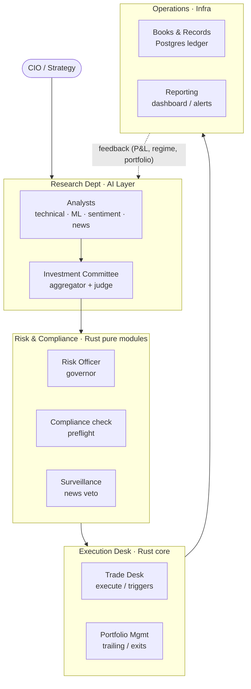
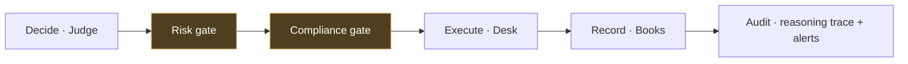
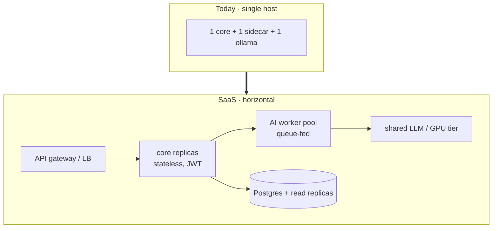

# Enterprise Operating Model

> "Simulate how a large organisation's system operates." This note re-frames Quorum's software components as if they were the **departments of a trading firm**, then shows the path from single-tenant tool to multi-tenant SaaS platform. It's a design lens, not new code.

## The system *is* an org chart

A disciplined trading desk has specialists, a risk office, a trade desk, and a COO. Quorum encodes exactly that division of labour — which is why the architecture feels like an institution rather than a script.

| Org function | Software component | Mandate |
|--------------|--------------------|---------|
| **Investment Committee** | aggregator + judge | Turn diverse research into one accountable decision; require quorum. |
| **Research analysts** | council agents | Independent, specialised opinions; abstain when unsure. |
| **Risk Officer** | `governor` + `risk` | Hard limits on size, exposure, daily loss; can halt the desk. |
| **Compliance** | `preflight` | No order leaves the building that would obviously be rejected. |
| **Surveillance** | news veto | Kill a trade on a critical event regardless of conviction. |
| **Trade Desk** | `execute` / `check_triggers` | Best-effort fills, honest failure reporting. |
| **Portfolio Mgmt** | `check_exits` / trailing | Manage open risk; let winners run, cut losers. |
| **Books & Records** | Postgres ledger | The single source of P&L truth, broker-independent. |
| **COO / Ops** | Watcher + deploy + alerts | Keep the desk running, observable, recoverable. |

## Separation of duties (the control that matters)

No single component can both *decide* and *execute* without the risk gates in between — the same control a real firm uses to prevent a rogue trader. The judge proposes; the governor, preflight, and broker guard dispose.

## From tool to platform (scaling the org)

The multi-tenant spine ([[Data-Model-ERD]]) means scaling is an infrastructure exercise, not a rewrite.

| Concern | Today | At scale |
|---------|-------|----------|
| Compute | one process each | stateless core replicas behind a gateway; AI as a queue-fed worker pool |
| LLM | local Ollama | shared GPU inference tier with per-tenant rate limits & cost budgets |
| Tenancy | `account_id` scoping | row-level security + per-tenant encryption keys |
| Wire | JSON + optional QPACK | QPACK everywhere for the high-frequency WS fan-out |
| Brokers | Bitkub (+Binance skeleton) | broker plug-ins behind the `Broker` trait; regional routing |
| Trust | per-tenant keys in DB | KMS / vault, audited access |

## Governance & roadmap

The platform evolution is tracked as a **7-phase programme** (the way a firm runs an initiative): 0 correctness → 1 identity/multi-tenancy → 2 paper/live separation → 3 capital & risk governor → 4 plan visibility → 5 cloud AI providers → 6 binary wire (QPACK) → 7 polish & docs.

**Operating cadence** (simulated):
- *Real-time:* governor + alerts (the risk office never sleeps).
- *Per-cycle:* deep analysis re-underwrites every held position.
- *Per-release:* deterministic test gates (66 Rust + Python suites) before a production hot-swap.
- *Per-incident:* a failed order is an explainable, recorded event with a runbook entry. ([[Deployment-and-Security]])

> The lesson of the broker-coin incident ([[Broker-Integration]]) in org terms: *Operations was sourcing inventory the Trade Desk legally couldn't sell.* The fix was a procurement filter (tradable universe) plus a compliance backstop (order guard) — a process control, not a hero.

Related: [[Product-Vision]] · [[Clean-Architecture]] · [[Data-Model-ERD]]
