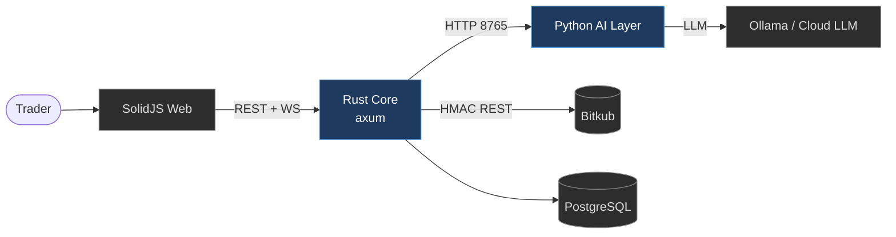

# ⚖️ Quorum — System Design Vault

> A multi-agent **consensus** trading platform. Many specialist AI agents analyse a market, a weighted aggregator forms a preliminary verdict, and a disciplined "judge" turns it into a risk-managed trade plan — executed and managed automatically, per tenant.

This vault is the **single source of design truth** for Quorum. It is written the way a product engineering org documents a large system: a context map at the top, drilling down through architecture → domain → runtime flows → components → operations, and finally an **enterprise operating model** that simulates how this system would run at organisational scale.

Open this folder as an Obsidian vault. Diagrams are Mermaid; navigation is via Obsidian wiki-links between notes.

---

## 🗺️ Map of Content

### 00 — Overview (start here)
- [[Product-Vision]] — the problem, the bet, the design principles
- [[System-Context]] — C4 Level 1: Quorum and the world around it
- [[Glossary]] — the vocabulary (regime, plan, governor, broker coin…)

### 01 — Architecture
- [[Container-Architecture]] — C4 Level 2: the deployable pieces & how they talk
- [[Clean-Architecture]] — the dependency rule inside the Rust core
- [[Component-Map]] — C4 Level 3: components per container

### 02 — Domain
- [[Domain-Model]] — entities, the trade-plan state machine
- [[Data-Model-ERD]] — PostgreSQL schema, multi-tenant scoping

### 03 — Runtime Flows
- [[Analysis-Pipeline]] — council → aggregator → judge
- [[Entry-Strategy]] — **regime-aware entries** (the heart of the edge)
- [[Order-Execution]] — signal → plan → preflight → broker → ledger
- [[Position-Management]] — trailing stops, breakeven, exits

### 04 — Components
- [[Broker-Integration]] — Bitkub adapter, exchange vs broker coins, multi-broker

### 05 — Operations
- [[Deployment-and-Security]] — topology, secrets model, runbook, kill-switch

### 06 — Enterprise Simulation
- [[Enterprise-Operating-Model]] — mapping the system to a large-org structure & scaling it to SaaS

---

## 📌 System at a glance

## 🧭 Design tenets

| # | Tenet | Where it shows up |
|---|-------|-------------------|
| 1 | **Consensus over a single oracle** | [[Analysis-Pipeline]] — 5 agents vote; no one agent can force a trade |
| 2 | **Trade rarely, trade well** | [[Entry-Strategy]] — regime-gated entries, RR thresholds |
| 3 | **Separate thinking from watching** | [[Order-Execution]] — deep analysis is infrequent; price-watch is cheap |
| 4 | **Every order can be pre-rejected** | [[Order-Execution]] — preflight + risk governor before any API call |
| 5 | **Multi-tenant by construction** | [[Data-Model-ERD]] — everything scoped by `account_id` |
| 6 | **Fail safe, fail loud** | [[Deployment-and-Security]] — kill-switch, governor, alerts |

> _Docs are in English to match the codebase and conventional design-doc style; ask if you'd prefer Thai._
